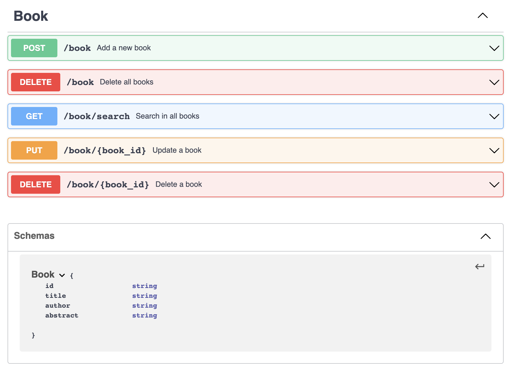

# HETIC - Library

This school project aim to create a small API to handle Elasticsearch documents.

## Team

PIERRON Marc, DOMART Bastien, NGUYEN Tan

## Stack

- GO - Gin (web framework) 
- Elasticsearch v7.13
- Kibana v7.13


<!-- ## The (school) project -->

# Getting started 

1. Install and run the project via docker
```sh
$ docker-compose up
```
2. - App API can be reached at [http://localhost](http://localhost)
    - Elasticsearch can be reached at [http://localhost:9200](http://localhost:9200)
    - Kibana can be reached at [http://localhost:5601](http://localhost:5601)


# App API

API documentation can be found at [./doc/API.yaml](./doc/API.yaml) written according to the OpenAPI 3.0 specification.



